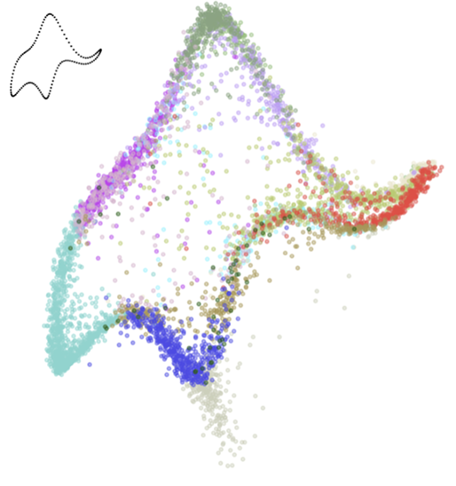

.. _clustering:

Clustering
=====

.. dropdown:: `The specious art of single-cell genomics <https://journals.plos.org/ploscompbiol/article?id=10.1371/journal.pcbi.1011288>`_ - T. Chari, and L. Pachter, 2023.

  .. grid:: 2

    .. grid-item::  Explores problems with low-dimensional embeddings.

    .. grid-item-card::  

      .. image:: ./figures/specious.png
                        :width: 150
                        :align: center
                        :alt: Elephant-shaped embeddings

.. dropdown:: `Biophysically Interpretable Inference of Cell Types from Multimodal Sequencing Data <https://doi.org/10.1101/2023.09.17.558131>`_ - T. Chari, G. Gorin, and L. Pachter, 2023.

  .. grid:: 2

    .. grid-item::  Enables interpretable and consistent cell cluster determination from multimodal data.

    .. grid-item-card:: 

      .. image:: ./figures/mek_means_image.png
                        :width: 300
                        :align: center
                        :alt: meK-Means Inference

