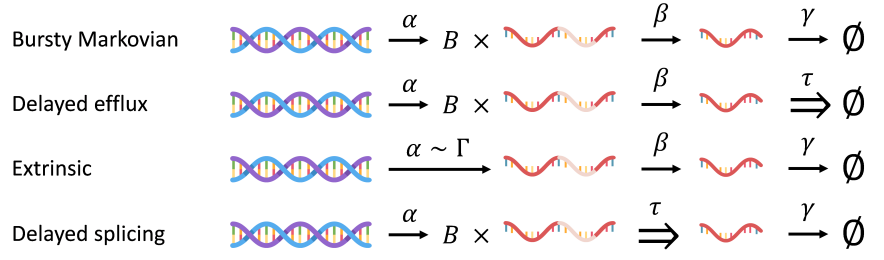

=====
Model Definition (+ noise)
=====

.. dropdown:: `Transient and delay chemical master equations <https://doi.org/10.1101/2022.10.17.512599>`_ - G. Gorin, S. Yoshida, L. Pachter

            
            Explores the transient and delay aspects of chemical master equations, contributing to the understanding of dynamic biochemical systems.  Explores the transient and delay aspects of chemical master equations, contributing to the understanding of dynamic biochemical systems. 

            |ico1|

* `Transient and delay chemical master equations <https://doi.org/10.1101/2022.10.17.512599>`_ - G. Gorin, S. Yoshida, L. Pachter

Explores the transient and delay aspects of chemical master equations, contributing to the understanding of dynamic biochemical systems.

* `Interpretable and tractable models of transcriptional noise for the rational design of single-molecule quantification experiments <https://doi.org/10.1038/s41467-022-34857-7>`_ - G. Gorin, JJ. Vastola, M. Fang, L. Pachter  

Proposes a new modeling approach for transcriptional noise, enhancing the interpretability and utility of single-molecule quantification experiments.

* `Modeling bursty transcription and splicing with the chemical master equation <https://doi.org/10.1016/j.bpj.2022.02.004>`_ - G. Gorin, L. Pachter

Develops a chemical master equation framework to model the bursty nature of transcription and splicing processes.

* `Length biases in single-cell RNA sequencing of pre-mRNA <https://doi.org/10.1016%2Fj.bpr.2022.100097>`_ - G. Gorin, L. Pachter 

Investigates the length biases present in single-cell RNA sequencing data, particularly in the context of pre-mRNA.

* `Intrinsic and extrinsic noise are distinguishable in a synthesis–export–degradation model of mRNA production <https://doi.org/10.1101/2020.09.25.312868>`_ - G. Gorin, L. Pachter

Differentiates between intrinsic and extrinsic noise in mRNA production using a comprehensive model involving synthesis, export, and degradation.

