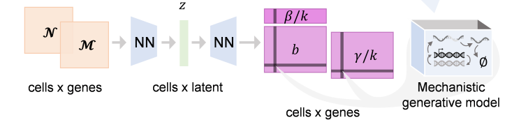

.. _bivi:

*biVI:* Biophysical modeling with variational autoencoders
================================================================= 
*biVI* is a package for inferring parameters for bursty, constitutive, and extrinsic noise models of transcription at single-cell resolution, with `source code, examples and tutorials available <https://github.com/pachterlab/CGCCP_2023>`_.

Installation: 

::

    pip3 install git+https://github.com/pachterlab/CGCCP_2023.git#subdirectory=BIVI

