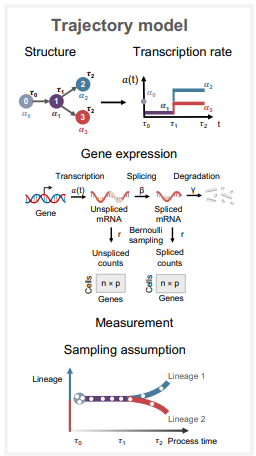

.. _chronocell:

Chronocell: trajectory inference from single-cell genomic data
================================================================= 
Chronocell (mechanistic K-means) infers "process time" of individual cells using single-cell RNA sequencing data, providing a biophysical formulation of trajectories built on cell state transitions. A `Github repository <https://github.com/pachterlab/FGP_2024>`_ is available with example notebooks.  

Installation: 

::

  pip install... coming soon 

