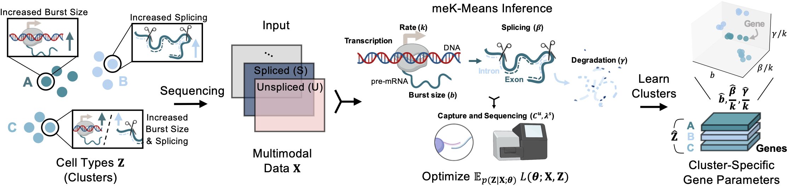

.. _mekmeans: 

meK-means: Biophysically interpretable inference of cell types
================================================================= 

**Abstract:** Multimodal, single-cell genomics technologies enable simultaneous capture of multiple facets of DNA and RNA processing in the cell. This creates opportunities for transcriptome-wide, mechanistic studies of cellular processing in heterogeneous cell types, with applications ranging from inferring kinetic differences between cells, to the role of stochasticity in driving heterogeneity. However, current methods for determining cell types or ‘clusters’ present in multimodal data often rely on ad hoc or independent treatment of modalities, and assumptions ignoring inherent properties of the count data. 

To enable interpretable and consistent cell cluster determination from multimodal data, we present meK-Means (mechanistic K-Means) which integrates modalities and learns underlying, shared biophysical states through a unifying model of transcription. In particular, we demonstrate how meK-Means can be used to cluster cells from unspliced and spliced mRNA count modalities. By utilizing the causal, physical relationships underlying these modalities, we identify shared transcriptional kinetics across cells, which induce the observed gene expression profiles, and provide an alternative definition for ‘clusters’ through the governing parameters of cellular processes.

Examples and tutorials are available `here <https://github.com/pachterlab/CGP_2023>`_. For more details, please `see the preprint <:https://doi.org/10.1101/2023.09.17.558131>`_.

Installation: 

::

  pip install monod

  import monod
  from monod import mminference #Function implementing meK-Means algorithm

