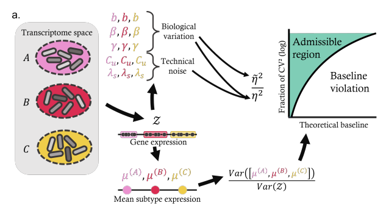

.. _monod:

*Monod*: CME inference from seq data
================================================================= 

Paper Abstract:

We present the Python package *Monod* for the analysis of single-cell RNA sequencing count data through biophysical modeling. *Monod* naturally “integrates” unspliced and spliced count matrices, and provides a route to identifying and studying differential expression patterns that do not cause changes in average gene expression. The *Monod* framework is open-source and modular, and may be extended to more sophisticated models of variation and further experimental observables.

The Monod package can be installed from the command line. The source code is available and maintained at `https://github.com/pachterlab/monod <https://github.com/pachterlab/monod>`_. A separate repository, which contains sample data and Python notebooks for analysis with Monod, is accessible at `https://github.com/pachterlab/monod_examples/ <https://github.com/pachterlab/monod_examples/>`_. Structured documentation and tutorials are hosted at `https://monod-examples.readthedocs.io/ <https://monod-examples.readthedocs.io/>`_.

For more details, please `see the preprint <https://doi.org/10.1101/2022.06.11.495771>`_.

Installation: 

::

    pip install monod

